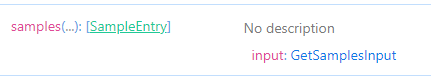
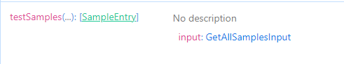

<!-- # GraphQl -->

# GraphQl

### Queries
In order to generate a query with CAI, we need to use the `[Query]` attribute
```c#
[Query<T>(queryName)]
```

| Fields | Datatype | Required |
| :---: | :---: | :----: |
|T| Generic | Yes |
|queryName | String |No|

#### NB
* if the `queryName` is not provided CAI takes care of providing the query name. We would see more examples below.


#### Example 1

```c#
[Query<SampleEntry[]>()]
public record GetAllSamples(string text, int num);
```

CAI generates the query above with name `allSamples` as seen in the image below

<p>
    
</p>


#### Example 2

```c#
[Query<SampleEntry[]>("testSamples")]
public record GetAllSamples(string text, int num);
```

CAI generates the query above with name `testSamples` as seen in the image below

<p>
    
</p>

### Query Complexity Management/Control

These features help manage the complexity of queries and ensure that clients can request only the data they need, improving efficiency and reducing the risk of over-fetching data.
They Include 
1. ``PAGING``
2. ``PROJECTION``
3. ``FILTERING``
4. ``SORTING``

**NB** :
 The query needs to be of **type** ``IQueryable<T>`` before the above can be implemented.