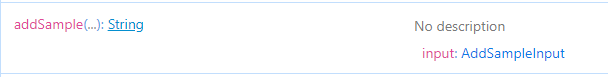
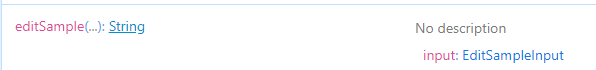

<!-- # GraphQl -->

# GraphQl

### Mutations
In order to generate a mutation with CAI, we need to use the `[Mutation]` attribute
```c#
[Mutation<T>(mutationName)]
```

| Fields | Datatype | Required |
| :---: | :---: | :----: |
|T| Generic | Yes |
|mutationName | String |No|

#### NB
* if the `mutationName` is not provided CAI takes care of providing the mutation name. We would see more examples below.


#### Example 1

```c#
[Mutation<string>()]
public record AddSample(string text);
```

CAI generates the query above with name `addSample` as seen in the image below

<p>
    
</p>


#### Example 2

```c#
[Mutation<string>("editSample")]
public record EditSample(int id, string text);
```

CAI generates the mutation above with name `editSample` as seen in the image below

<p>
    
</p>