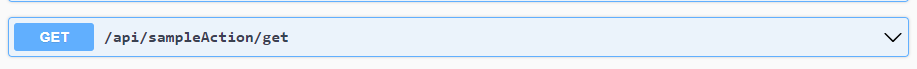
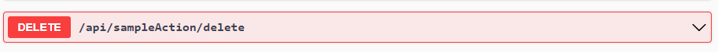
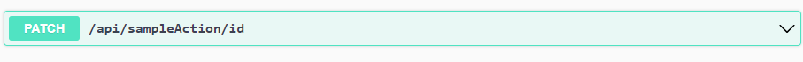

<!-- # GraphQl -->

# REST
In order to generate a RESTful endpoint with CAI, we need to use the `[Rest]` annotation
```c#
[Rest<T>(apiPath, httpVerb)]

```

| Fields | Datatype | Required |
| :---: | :---: | :----: |
| T | Generic | Yes |
| apiPath | String | Yes |
| httpVerb | GET, PUT, POST, DELETE, PATCH | Yes |


#### Example 1

```c#
[Rest<SampleEntry>("/api/sampleAction/get", Verb.Get)]
public record GetSample(string text);

```

<p>
    
</p>


#### Example 2

```c#
[Rest<SampleEntry>("/api/sampleAction/add", Verb.Post)]
public record AddSample(string text);


```

<p>
    
</p>


#### Example 3

```c#
[Rest<SampleEntry>("/api/sampleAction/delete", Verb.Delete)]
public record DeleteSample(int id);


```

<p>
    
</p>

#### Example 4

```c#
[Rest<SampleEntry>("/api/sampleAction/id", Verb.Put)]
public record UpdateSample(int id, string text);


```

<p>
    
</p>

#### Example 5

```c#
[Rest<SampleEntry>("/api/sampleAction/id", Verb.Patch)]
public record EditSample(int id, string text);

```

<p>
    
</p>