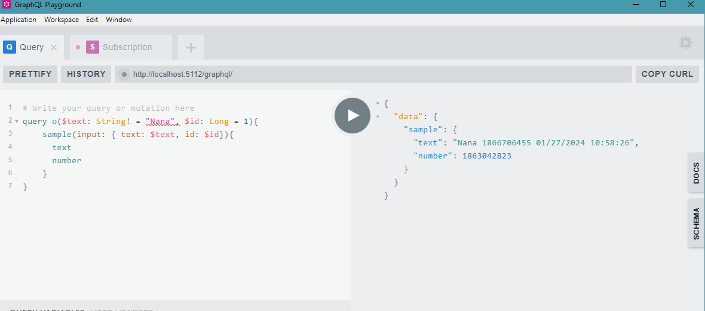
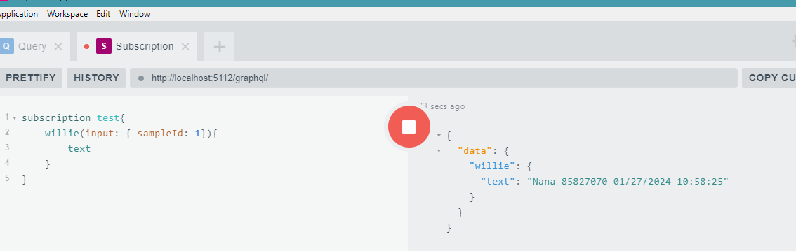
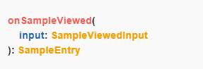

---
prev:
  text: 'Handler'
  link: '/routes/handler'

next: 
  text: 'Rest'
  link: '/routes/rest'
---

# GraphQl

### Subscription

After generating the queries, mutations , it is best to have a service that notifies the user of any set action taken on the system.
This is where the subscription service comes in.

In CAI ,**Subscription** uses the `[Subscription]` attribute to be able to generate a subscription

```c#
[Subscription<T>(subscriptionName)]

```

### TYPES

**Static Subscriptions**

In this type of subscription, a topic needs to be provided likewise the name in the attribute declaration.

This type of subscription is mostly used for debugging purposes because the result is already known to the developer.

This type of subscription is easier to implement compared to the ``` Dynamic Subscription``` .

#### Example1
```c#
[Subscription<SampleEntry>(name = "onUpdated", topic = "sampleUpdated")]
```
| Fields | Datatype | Required |
| :---: | :---: | :----: |
|T| Generic | Yes |
|name | String |Yes|
|topic| String |Yes|

#### NB 

The ```name``` param needs to be prefixed with the ``` on ``` word.

The ```topic``` param when implemented  sends a message the subscriber listens by. 


#### Dynamic Subscriptions

In this type of subscription, the developer doesn't necessariy need to specify a name and topic.

This type subscription works like a notifications system whereby the service waits and filters incoming notifications and displays the specified type of notification to be displayed.

#### Example2

```c#
[Subscription<SampleEntry>()]
//OR
[Subscription<SampleEntry>("preferedName")]
```
<p> 
<b>Query</b> 

</p>
<p>
<b>Subscription</b>

</p>

| Fields | Datatype | Required |
| :---: | :---: | :----: |
|T| Generic | Yes |
|name | String |No|

#### NB 
The subscription ```name``` if not specified automatically picks the name of the record it is attributing and adds the ``on`` prefix.

The subscription ```topic``` is composed as seen in the [handler example 6](../routes/handler.md) using the ```CAI GetSubscriptionTopic``` .

```c#
[Subscription<SampleEntry>()]
public record SampleViewed(long sampleId);
```
<p>

</p>

